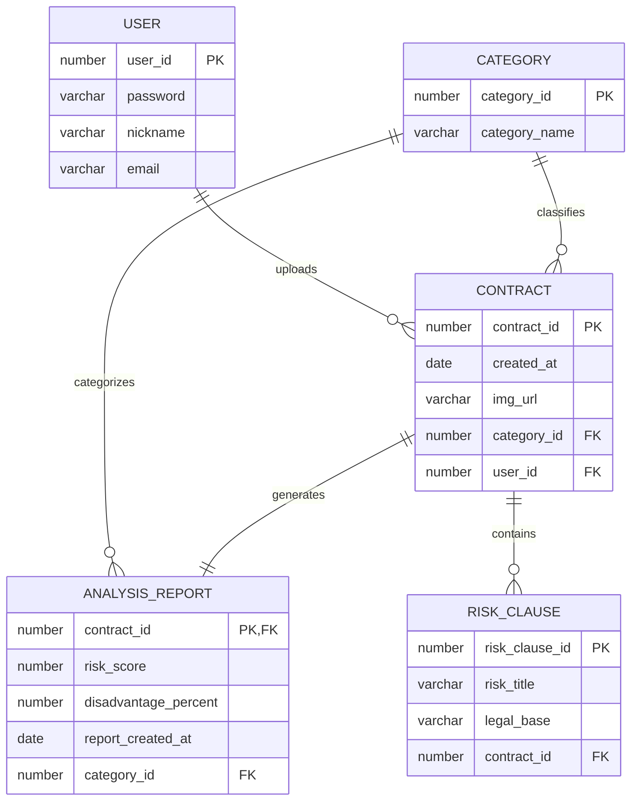

<div align="center">

  # ⚖️ AI-Lawyer (올라운드 법률 에이전트)

  **"어렵고 복잡한 계약서 분석부터 실시간 사후 감시까지, AI 기반 법률 리스크 관리 솔루션"**

  [](https://nextjs.org/)
  [](https://spring.io/projects/spring-boot)
  [](https://github.com/langchain4j/langchain4j)
  [](https://supabase.com/)
  [](LICENSE)
</div>

---

## 🌟 프로젝트 개요 (Project Overview)

**AI-Lawyer**는 복잡한 법률 용어와 높은 자문 비용으로 인해 법적 접근성이 낮은 개인 및 소상공인을 위해 개발된 **계약서 법률 자동 분석 및 실시간 챗봇 서비스**입니다. 

사용자가 업로드한 계약서의 유불리 조항을 정밀 분석하여 리스크 점수를 도출하고, 사용자 맞춤형 대시보드와 RAG(Retrieval-Augmented Generation) 기반의 챗봇 상담을 제공함으로써 법률 리스크를 사전에 예방합니다.

- **진행 기간**: 2026.03.13 ~ 2026.03.18 (팀 프로젝트)
- **주요 성과**: 다중 LLM 연동을 통한 분석 정확도 및 비용 최적화, 자동 알림 시스템 구축을 통한 사용자 편의성 증대

---

## 👥 팀원 소개 (Team Members)

| 이름 | 역할 | 주요 기여 내용 |
| :--- | :--- | :--- |
| **유재복** | **PM** | 문서분석, 분석결과리포트, RAG 기반 챗봇, DB 설계, 배포 |
| **탁유제** | **PL** | 계약서 전체/유형별 대시보드, Stitch UI/UX 설계, DB 설계, PPT 제작 |
| **강민재** | **Dev** | 계약서 내 마감기한 추출 시 알림 시스템 구축 |
| **박시원** | **Dev** | 회원가입 기능 구현 및 보안 최적화 |
| **이진영** | **Dev** | 로그인 기능 구현 및 인증 프로세스 관리 |
| **문광명** | **Dev** | AI 기반 2가지 계약서 동시 분석 및 비교 결과 리포트 개발, DB 설계 |

---

## ⚙️ 백엔드 핵심 수행 역할 (Action & Result)

### 1. LLM 다중 연동 및 기능별 모듈화 아키텍처 설계
- **기능별 모듈화**: 인증, AI 분석, 리포트/검색, 알림 서비스를 독립적인 모듈로 설계하여 유지보수성과 확장성을 높였습니다.
- **다중 모델 전략**: **LangChain4j**를 도입하여 정밀 분석에는 `Gemini-2.5-flash`를, 빠른 간략 분석에는 **Groq API**(`llama-3.3-70b`)를 연동하는 등 목적에 맞는 하이브리드 AI 로직을 구축했습니다.
- **시맨틱 검색 구현**: 차세대 검색 기능을 위해 **Supabase pgvector** 확장을 적용, 벡터 데이터베이스 아키텍처를 구성하여 정확도 높은 RAG 시스템을 구현했습니다.

### 2. Spring Security와 JWT를 활용한 인증 및 인가 처리
- **보안 강화**: **JJWT** 라이브러리를 통해 JWT 토큰 기반의 무상태(Stateless) 세션 관리를 구현했습니다.
- **접근 제어**: **Spring Security**를 기반으로 API 엔드포인트별 권한을 세밀하게 제어하고, BCrypt 암호화 알고리즘을 적용하여 사용자 기밀 정보를 안전하게 저장했습니다.

### 3. 스케줄링을 통한 스마트 자동 알림 서비스
- **추출 및 매칭**: AI가 계약서 내에서 마감 기한을 자동으로 추출하고, 이를 시스템 날짜와 실시간으로 대조합니다.
- **자동화 로직**: 만료 10일 이내인 조항이 발견될 경우, **Spring Scheduler**를 활용해 사용자에게 즉시 알림을 전송하는 능동적인 리스크 관리 기능을 구현했습니다.

---

## 🗄️ 데이터베이스 설계 (ERD)



---

## 🏗 시스템 아키텍처 (Architecture)


---

## 🛠 기술 스택 (Tech Stack)

### Backend
- **Core**: Java 17, Spring Boot 3.5
- **Security**: Spring Security, JWT (JJWT)
- **Data**: JPA (Hibernate), PostgreSQL (Supabase), pgvector
- **AI**: LangChain4j, Gemini API, Groq API (Llama 3.3)
- **Tooling**: Gradle, Docker

### Frontend
- **Framework**: Next.js 15 (App Router), React 19
- **Styling**: Tailwind CSS 4
- **State/Chart**: Recharts, Lucide React

### Infrastructure / Deployment
- **BE Deployment**: Koyeb (Docker image based Deployment)
- **FE Deployment**: Netlify (CI/CD Integrated)
- **Storage**: Supabase Storage

---

## 🛠 핵심 트러블슈팅 (Troubleshooting)

### [트러블슈팅 1] 분리된 배포 환경에서의 CORS 에러 및 API 통신 차단 해결
- **Situation**: 프론트엔드(Netlify)와 백엔드(Koyeb)가 서로 다른 도메인으로 분리 배포된 환경에서, 브라우저의 동일 출처 정책(SOP)으로 인해 교차 출처 API 요청이 전면 차단되는 문제 발생.
- **Action & Result**: 백엔드의 `SecurityConfig`에서 `CorsConfigurationSource`를 정의하고 프론트엔드 도메인을 명시적으로 화이트리스트에 추가(`setAllowedOrigins`)했습니다. 이를 통해 보안 수준을 유지하면서도 안정적인 크로스 플랫폼 데이터 통신을 가능하게 했습니다.

### [트러블슈팅 2] AI 코딩 어시스턴트 활용 시 발생하는 코드 파편화 및 DB 매핑 오류 해결
- **Situation**: 개발 속도 향상을 위해 AI 도구를 활용하였으나, AI가 프로젝트 컨벤션을 무시하고 대소문자를 혼용(예: Supabase의 `User` 테이블을 코드 내에서 `user`로 참조)하여 DB 매핑 런타임 에러가 빈번하게 발생하는 위험이 있었습니다.
- **Action**: 단순히 AI를 사용하는 것을 넘어 '올바르게 통제'하기 위해 Root 디렉토리에 `.ai-rules.md`를 추가하여 팀 네이밍 규칙을 시스템화했습니다. 또한 `entity-guide.md` 워크플로우를 생성하여 엔티티 작성 시 대소문자 확인 지침을 인스트럭션(Instruction)으로 명문화했습니다.
- **Result**: AI가 팀의 규칙을 학습하여 일관된 코드를 생성하게 됨으로써 버그 발생률을 제로화했고, 결과적으로 개발 효율성을 약 30% 이상 향상시키는 성과를 거두었습니다.

---

## 🚀 시작하기 (Getting Started)

### 사전 요구 사항 (Prerequisites)
- Node.js 20+ | Java 17+
- API Keys: Gemini, Groq
- Database: Supabase (PostgreSQL with pgvector)

### 실행 방법
1. **Repository Clone**
   ```bash
   git clone https://github.com/human13th2team/test-repository.git
   ```
2. **Backend Setup**
   - `backend/src/main/resources/.env` 설정 후 `./gradlew bootRun`
3. **Frontend Setup**
   - `frontend/.env.local` 설정 후 `npm install && npm run dev`

---

<div align="center">
  <b>Representative:</b> ashfortune (Human13th Team) | <b>Contact:</b> support@ai-lawyer.com
</div>